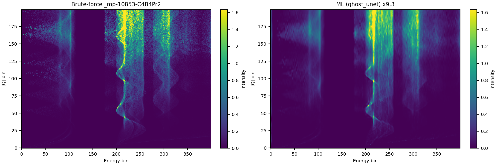

# ALC project: Physics-informed machine learning for accelerating inelastic neutron powder data analysis

This repository contains scripts related to the Ada-Lovelace-Centre project:
"Physics-informed machine learning for accelerating inelastic neutron powder data analysis",
which aims to speed up neutron powder averaging by using a single-image super-resolution neural network.

We explored 6 different types of models, defined in the [model.py file](scripts/model.py):

* `srcnn` - a simple 3-layer convolution neural network based on the original paper of [Dong et al.](https://arxiv.org/abs/1501.00092).
* `unet` - a U-Net using residual convolution blocks as suggested in the paper of [Lim et al.](https://arxiv.org/abs/1707.02921).
* `fno` - a network based on Fourier Neural Operators as described by [Li et al.](https://arxiv.org/abs/2010.08895)
* `wfdn_fno` - a hybrid network combining Wide-Activation Distillation blocks of [Su et al.](https://doi.org/10.3390/s24144597) with FNOs.
* `ghost_wfdn` - the `wfdn_fno` network but with half of the channels of the convolutions in the attention blocks replaced by cheaper depth-wise convolutions as suggested by [Han et al.](https://arxiv.org/abs/1911.11907).
* `ghost_unet` - a hybrid network combining FNOs with the residual U-Net with half the convolution channels replaced by ghost connects like the previous model.

The [`gen_training.py`](scripts/gen_training.py) script will generate training and validation data and train the specified model using the follow syntax:

```sh
cd scripts
python gen_training.py --model unet --input-size 50x400 --output-size 200x400 --limit 2000 --epochs 50 --batch-size 8 --lr 2e-4 --npts 200-1000 --blacklist blacklist.txt
```

where the `model` is one of the six above, `input-size` and `output-size` are the pixel sizes of the low-resolution/high-resolution image pairs the network learns, 
and `limit` is the number of crystal structures to sample (obtained from the [Materials Project](https://next-gen.materialsproject.org/materials)). 
The images are phonon spectra generated using the [Euphonic](https://euphonic.readthedocs.io) code
with force-constants obtained by the [MACE-MPA](https://github.com/ACEsuit/mace) machine-learnt inter-atomic potential,
with a fixed $|Q|$ range from 0 to 6 Å$^{-1}$ and energy range from 0 to 60 meV.
The `npts` parameter is the pair of points per $|Q|$ bin to use for the low-resolution / high-resolution image.

Because we use structures from the Materials Project, to run the above script you need to get a Materials Project API key and paste it into line 27 of the script.

At each epoch, the training script saves a checkpoint file. The [`gen_eval.py`](scripts/gen_eval.py) can take this as input and compute the speed-up
and an image of the results:

```
python gen_eval.py --ckpt checkpoints/ghost_unet.pt --num 10
```




# Environment

This will setup a virtualenv which can be used to run the above scripts.

```sh
mamba create -n janus311 -c mantid mantidworkbench=6.13 ase codecarbon phonopy pymatgen rich typer pytorch-gpu e3nn=0.4.4 opt_einsum torch-ema torchmetrics matscipy python-lmdb orjson scikit-learn mp-api
mamba activate janus311
python -m pip install --no-deps janus-core mace-torch
```
